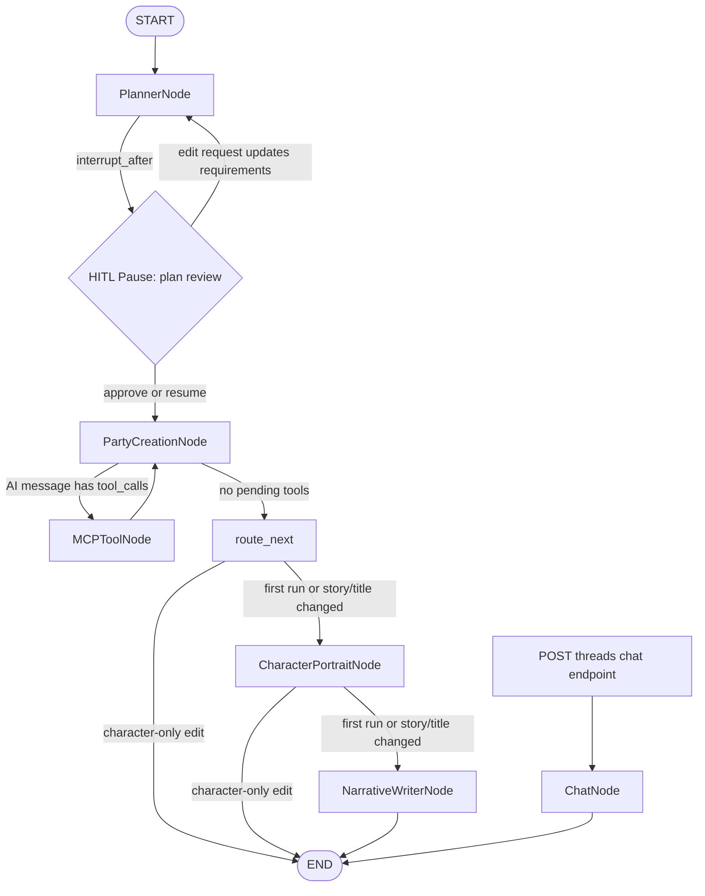
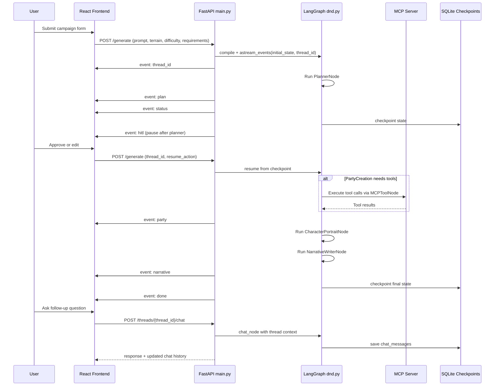

# How DnD Quest Provider Works (Deep Dive)

This document explains the runtime architecture in detail, with focus on:

- how the LangGraph pipeline is wired,
- what each node reads/writes,
- how the FastAPI server streams state,
- and how the React frontend consumes and renders it.

---

## 1) System Overview

At runtime, three services work together:

1. **Next.js frontend** (`frontend/`) on `localhost:3000`
2. **FastAPI API** (`main.py`) on `localhost:8001`
3. **MCP server** (`dnd-mcp/dnd_mcp_server.py`) on `localhost:8000/sse`

Generation flow:

- Browser sends `POST /generate`
- FastAPI compiles/runs LangGraph from `dnd.py`
- Graph emits progress via SSE events (`plan`, `party`, `narrative`, `status`, etc.)
- Frontend parses stream and updates UI incrementally
- State is checkpointed in SQLite so threads can be resumed and chatted with later

---

## 2) Backend Layers

### 2.1 API layer (`main.py`)

`main.py` is the orchestration shell around LangGraph.

Responsibilities:

- Exposes HTTP endpoints (`/generate`, `/threads`, `/threads/{id}`, `/chat`, `/export/pdf`)
- Handles CORS for the local frontend
- Compiles graph with `AsyncSqliteSaver` for persistence (`db/state.db`)
- Streams graph events to frontend using Server-Sent Events (SSE)
- Implements pause/resume behavior around planner approval (HITL)

### 2.2 Graph/workflow layer (`dnd.py`)

`dnd.py` defines:

- Pydantic schemas for all structured state
- AI models (`research_model`, `writer_model`)
- Node functions (planner, party, tool, portraits, narrative, chat)
- Routing logic (`determine_next_steps`, tool routing)
- Final graph construction + compilation

### 2.3 Tooling layer (MCP)

`mcp_server_session()` opens an SSE client session to the local MCP server and loads tools dynamically via `load_mcp_tools`.

If MCP is unavailable, nodes degrade gracefully:

- tool list becomes empty,
- party generation falls back to structured generation without tools.

---

## 3) LangGraph State Model

Central state class: `CampaignState`.

Key fields:

- **Inputs**: `terrain`, `difficulty`, `requirements`
- **Planner output**: `campaign_plan` (`CampaignPlan`)
- **Party output**: `party_details` (`PartyDetails`)
- **Narrative output**: `title`, `description`, `background`, `rewards`
- **Chat**: `chat_messages`, `chat_response`
- **Message accumulator**: `messages` (LangChain messages for node/tool handoffs)

Important detail: `messages` is annotated with additive behavior (`operator.add`) so node outputs can append instead of replacing.

---

## 4) Graph Nodes (What Each Node Does)

## 4.1 `PlannerNode`

Purpose:

- Create or update a structured `CampaignPlan`.

How it works:

- Generates an initial spark and research query
- Tries Google-native tool-assisted ideation via model tool call
- Falls back to DuckDuckGo + Wikipedia tool wrappers on failure
- Produces strict structured output (`CampaignPlan`) with constraints

Writes:

- `campaign_plan`

---

## 4.2 `PartyCreationNode`

Purpose:

- Build full `PartyDetails` (characters, stats, gear/spells).

How it works:

- Seeds characters from planner's `suggested_party` if available
- Connects to MCP and binds tools to model when available
- Prompts model to use tool knowledge for class gear/spells
- Uses retry loop for resilience
- If model does not call tools, forces structured output anyway
- Fills missing characters with deterministic fallback templates

Writes:

- usually `messages` first (AI tool call response)
- eventually `party_details`

---

## 4.3 `MCPToolNode`

Purpose:

- Execute MCP tool calls emitted by `PartyCreationNode`.

How it works:

- Builds `ToolNode` from loaded MCP tools
- Invokes tools against current graph state
- Sanitizes tool message payloads before returning

Writes:

- `messages` (tool results)

Then control returns to `PartyCreationNode` for final structuring.

---

## 4.4 `CharacterPortraitNode`

Purpose:

- Generate image assets (villain, each hero, cover, group portrait, macguffin).

How it works:

- Calls Gemini image model helpers returning base64
- Generates villain + character portraits first
- Generates cover from key location
- Generates group image using multimodal references from per-character images
- Falls back to non-multimodal prompt if stitching fails

Writes:

- mutates image fields in `party_details` and `campaign_plan`

---

## 4.5 `NarrativeWriterNode`

Purpose:

- Convert structured plan + party facts into final prose sections.

How it works:

- Clears tool-call messages from previous node context
- Removes huge base64 payloads before prompting (token safety)
- Supports edit mode: preserve style/structure and adjust only requested parts
- Uses structured output `CampaignContent`

Writes:

- `title`, `description`, `background`, `rewards`

---

## 4.6 `ChatNode`

Purpose:

- Handle post-generation DM-style Q&A in-thread.

How it works:

- Builds compressed campaign context from plan/party/narrative fields
- Rehydrates previous chat turns as conversation messages
- Invokes `writer_model` for the latest user question

Writes:

- `chat_response` (saved by API route into checkpointed state)

---

## 5) Graph Wiring & Routing Logic

### 5.1 LangGraph State Graph (Mermaid)

### 5.2 Reading the graph

- `PlannerNode` is the required entry point for campaign generation.
- `MCPToolNode <-> PartyCreationNode` is an iterative tool-execution loop until no tool calls remain.
- `route_next` is a routing helper node used to satisfy conditional edge wiring.
- `ChatNode` is not part of the normal generate pipeline; it is entered via the chat API route for existing threads.

### 5.3 Frontend-Backend SSE Sequence (Mermaid)

Registered nodes:

- `PlannerNode`
- `PartyCreationNode`
- `MCPToolNode`
- `CharacterPortraitNode`
- `NarrativeWriterNode`
- `ChatNode`
- `route_next` (dummy passthrough node used for conditional routing)

Entry edge:

- `START -> PlannerNode`

Primary conditional logic:

- `PlannerNode` routes via `determine_next_steps(..., "PlannerNode")` (normally to `PartyCreationNode`)
- `PartyCreationNode` routes to:
  - `MCPToolNode` when latest AI message has `tool_calls`
  - `route_next` when done (no pending tools)
- `MCPToolNode -> PartyCreationNode` (tool loop)
- `route_next` routes to `CharacterPortraitNode`, `NarrativeWriterNode`, or `END`
- `CharacterPortraitNode` routes to `NarrativeWriterNode` or `END`
- `NarrativeWriterNode -> END`
- `ChatNode -> END`

Behavioral nuance:

- On first generation (no `state.title` yet), flow continues to portraits and narrative.
- On edits, lightweight LLM routing decides if story/title changed; if not, graph can terminate early.

---

## 6) Interrupt + Resume (HITL)

The graph is compiled with `interrupt_after=["PlannerNode"]`.

That means initial run pauses right after planning so the UI can ask the user:

- approve current plan, or
- submit a custom/suggested revision.

In `POST /generate`:

- New run: sends initial state and streams until interrupt
- Resume with `resume_action="approve"`: continues from checkpoint
- Resume with custom action: API updates state (`requirements`, clears `campaign_plan`) and re-runs from planner

Frontend receives `hitl` event and renders controls for user choice.

---

## 7) React Frontend Architecture

Main UI lives in `frontend/app/page.tsx` as a client component.

### 7.1 State buckets

Core state groups:

- **Generation output**: `campaignPlan`, `partyDetails`, `narrative`
- **Thread/session**: `threadId`, `isLoadingHistory`, `status`
- **HITL**: `hitlData`
- **Chat**: `chatMessages`, `isChatLoading`, chatbox size/open flags
- **Input controls**: `prompt`, `difficulty`, `terrain`, `partyName`, `partySize`, `requirements`

### 7.2 API interaction modes

1. **New generation** (`handleSubmit`)
   - POST to `/generate`
   - parse SSE incrementally via `processStream`

2. **Resume generation** (`handleResume`)
   - POST `/generate` with `thread_id` + `resume_action`
   - continue parsing SSE

3. **Load existing thread** (`handleSelectThread`)
   - GET `/threads/{id}`
   - restore plan/party/narrative + chat history

4. **In-thread chat**
   - POST `/threads/{thread_id}/chat`
   - replace local chat state with server-authoritative history

### 7.3 SSE event contract used by React

`processStream` parses event/data blocks and maps to state updates:

- `thread_id` -> sets current thread + localStorage
- `status` -> progress message
- `plan` -> updates campaign plan section
- `party` -> updates party section
- `narrative` -> updates prose section
- `hitl` -> pauses stream UI and shows approval options
- `done` -> marks generation complete
- `error` -> surfaces backend traceback/error text

### 7.4 UI composition

`page.tsx` composes these major components:

- `Sidebar` (thread history/select)
- `HitlControls` (approve/edit branch selection)
- `CampaignLore`, `VillainCard`, `CharacterSheet` / carousel views
- `ExportPanel` (HTML->PDF export using backend)
- `ThemeToggle`

The page switches between:

- **generation form mode**,
- **live status + output mode**,
- **post-generation chat mode**.

---

## 8) Persistence Model

Two persistence mechanisms are active:

1. **LangGraph checkpoints** in `db/state.db`
   - thread-level graph continuation + state recovery

2. **Frontend localStorage**
   - `dnd_active_thread_id` restores the last viewed thread on reload

`GET /threads` derives metadata from checkpoint tables and joins `threads_meta` (archive flag).

---

## 9) PDF Export Path

Frontend `ExportPanel` builds print-oriented HTML and sends it to:

- `POST /export/pdf`

Backend then:

- loads Playwright async API dynamically,
- opens headless Chromium,
- waits for image load completion,
- renders A4 PDF with print backgrounds,
- returns `application/pdf` as downloadable attachment.

---

## 10) Practical Extension Points

If you want to evolve the system cleanly:

- **Add node behavior**: extend `CampaignState`, implement node function, wire conditional edges
- **Add MCP capability**: implement tool/resource in `dnd-mcp/src`, expose through MCP server, then consume in party/planner prompts
- **Adjust routing**: modify `determine_next_steps` and edge maps
- **Improve UX**: add new frontend component fed by existing SSE event channels (or add a new event type in `main.py` + parser in `processStream`)

---

## 11) Known Tradeoffs in Current Design

- Single large client page (`page.tsx`) handles many responsibilities; modularization could improve maintainability.
- Some routing decisions use lightweight LLM yes/no classification; deterministic rules may be preferable for strict reproducibility.
- Base64 image data is large; current code strips image strings before narrative prompting to avoid token overflow, but checkpoint size can still grow.

---

## 12) Quick Mental Model

Think of the app as:

- **Planner-first workflow** with mandatory approval pause,
- **tool-assisted party creation** loop,
- **image enrichment** stage,
- **final prose synthesis** stage,
- then **persistent campaign thread chat**.

That model maps directly to the graph and to the frontend event-driven UI.